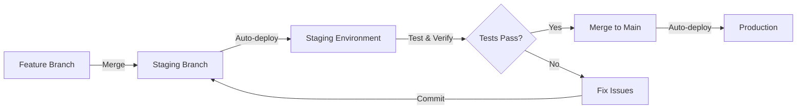

# Dreadfolio Deployment Guide

This guide walks through deploying the Dreadfolio monorepo using AWS Amplify Hosting for static apps and AWS Lambda for the backend API.

## Architecture Overview

```
┌─────────────────────────────────────────────────────────┐
│                    GitHub Repository                     │
│                   dreadfolio monorepo                    │
└─────────────────────────────────────────────────────────┘
                            │
                            │ Git push triggers builds
                            │
        ┌───────────────────┴───────────────────┐
        │                                       │
        ▼                                       ▼
┌──────────────────┐                  ┌──────────────────┐
│  AWS Amplify     │                  │  AWS Lambda      │
│  (15 apps)       │                  │  + API Gateway   │
│                  │                  │                  │
│ • camera-tricks  │                  │ • su-done-ku API │
│ • portfolio      │                  │                  │
│ • su-done-ku     │◄─────API calls───┤                  │
│ • sketches       │                  │                  │
│ • ... (11 more)  │                  │                  │
└──────────────────┘                  └──────────────────┘
        │                                       │
        │ CloudFront CDN                        │
        │                                       │
        ▼                                       ▼
┌─────────────────────────────────────────────────────────┐
│                      Route 53 DNS                        │
│                                                          │
│  staging.scottjhetrick.com/* → Staging apps              │
│  scottjhetrick.com/* → Production apps                   │
└─────────────────────────────────────────────────────────┘
```

## Prerequisites

- AWS Account with appropriate permissions
- AWS CLI installed and configured (`aws configure`)
- AWS SAM CLI installed (`brew install aws-sam-cli` or see [AWS SAM docs](https://docs.aws.amazon.com/serverless-application-model/latest/developerguide/install-sam-cli.html))
- GitHub repository connected to AWS Amplify
- Domain registered (scottjhetrick.com) with Route 53

## Deployment Phases

### Phase 1: Setup Lambda API (30 minutes)

The su-done-ku backend API needs to be deployed first so the frontend can reference it.

#### 1.1 Deploy Sudoku API Lambda

```bash
cd infrastructure/lambda/sudoku-api

# Install dependencies
pnpm install

# Build the function
pnpm build

# Deploy to staging
sam deploy \
  --template-file template.yaml \
  --stack-name sudoku-api-staging \
  --parameter-overrides Environment=staging \
  --capabilities CAPABILITY_IAM \
  --region us-east-1 \
  --guided

# Get the API URL
aws cloudformation describe-stacks \
  --stack-name sudoku-api-staging \
  --query 'Stacks[0].Outputs[?OutputKey==`SudokuApiUrl`].OutputValue' \
  --output text
```

Save the API URL - you'll need it for the frontend configuration.

#### 1.2 Test the Lambda API

```bash
# Test with curl (replace with your actual API URL)
curl "https://xxxxxxxxxx.execute-api.us-east-1.amazonaws.com/staging/random?difficulty=easy"
```

Expected response:
```json
{
  "difficulty": "easy",
  "puzzle": {
    "sha": "...",
    "rating": "...",
    "puzzle": "4.....8.5.3..........7......2.....6.....8.4......1.......6.3.7.5..2.....1.4......"
  }
}
```

### Phase 2: Create Amplify Apps (1-2 hours)

#### 2.1 Automated Creation (Recommended)

```bash
# Run the automated setup script
./infrastructure/scripts/create-amplify-apps.sh
```

This creates 15 Amplify apps with proper configuration.

#### 2.2 Manual Creation (Alternative)

If the script doesn't work, manually create apps via AWS Console:

1. Go to [AWS Amplify Console](https://console.aws.amazon.com/amplify/)
2. For each app, click "New app" → "Host web app"
3. Select GitHub and connect your repository
4. Configure:
   - App name: `dreadfolio-[app-name]`
   - Branch: `staging` and `main`
   - Build settings: Use the `amplify.yml` in each app directory
5. Deploy

### Phase 3: Configure Environment Variables (30 minutes)

For each Amplify app, configure required environment variables:

#### 3.1 Gifster

```
VITE_GIPHY_API_KEY=<your-giphy-api-key>
```

#### 3.2 Su-done-ku

```
VITE_SUDOKU_API_URL=https://xxxxxxxxxx.execute-api.us-east-1.amazonaws.com/staging/random
```

#### 3.3 Fallcrate & ShareMe (Firebase apps)

```
VITE_FIREBASE_API_KEY=<your-firebase-key>
VITE_FIREBASE_AUTH_DOMAIN=<your-project>.firebaseapp.com
VITE_FIREBASE_PROJECT_ID=<your-project>
VITE_FIREBASE_STORAGE_BUCKET=<your-project>.appspot.com
VITE_FIREBASE_MESSAGING_SENDER_ID=<your-sender-id>
VITE_FIREBASE_APP_ID=<your-app-id>
```

#### 3.4 Turborepo Remote Caching (Optional)

For faster builds, configure Vercel Remote Caching:

```
TURBO_TOKEN=<your-vercel-token>
TURBO_TEAM=<your-team-slug>
```

### Phase 4: Setup Custom Domains (1 hour)

#### 4.1 Staging Environment

For each Amplify app:

1. Open the app in Amplify Console
2. Go to "Domain management"
3. Click "Add domain"
4. Enter: `staging.scottjhetrick.com`
5. Configure subpath:
   - App: `camera-tricks-demo` → Path: `/camera-tricks`
   - App: `su-done-ku` → Path: `/su-done-ku`
   - App: `sketches` → Path: `/sketches`
   - etc.

Amplify will automatically:
- Create Route 53 DNS records
- Provision SSL certificates
- Configure CloudFront

#### 4.2 Production Environment

Same process, but use `scottjhetrick.com` instead of staging subdomain.

**Domain mapping example:**

| App | Staging URL | Production URL |
|-----|------------|----------------|
| portfolio-frontend | staging.scottjhetrick.com | scottjhetrick.com |
| camera-tricks-demo | staging.scottjhetrick.com/camera-tricks | scottjhetrick.com/camera-tricks |
| su-done-ku | staging.scottjhetrick.com/su-done-ku | scottjhetrick.com/su-done-ku |
| sketches | staging.scottjhetrick.com/sketches | scottjhetrick.com/sketches |

### Phase 5: Branch Strategy & Deployment Workflow

#### 5.1 Git Branch Setup

```bash
# Create staging branch if it doesn't exist
git checkout -b staging

# Push to remote
git push -u origin staging
```

#### 5.2 Development Workflow



**Workflow steps:**

1. **Develop**: Work on feature branches
2. **Staging**: Merge to `staging` → auto-deploys to staging.scottjhetrick.com
3. **Test**: Verify all functionality in staging
4. **Production**: Merge `staging` → `main` → auto-deploys to scottjhetrick.com

### Phase 6: Testing Staging Deployment (1-2 hours)

#### 6.1 Test Each App

Go through each app and verify:

- [ ] camera-tricks-demo: `https://staging.scottjhetrick.com/camera-tricks`
- [ ] portfolio-frontend: `https://staging.scottjhetrick.com`
- [ ] su-done-ku: `https://staging.scottjhetrick.com/su-done-ku`
  - Test API calls work correctly
  - Verify puzzles load
- [ ] sketches: `https://staging.scottjhetrick.com/sketches`
- [ ] All other apps...

#### 6.2 Verify SSL/HTTPS

All apps should:
- Use HTTPS
- Have valid SSL certificates
- Redirect HTTP → HTTPS automatically

#### 6.3 Performance Testing

Check CloudFront CDN is working:

```bash
# Test TTFB (Time To First Byte) from different locations
curl -w "\nTime to first byte: %{time_starttransfer}s\n" \
  -o /dev/null -s \
  "https://staging.scottjhetrick.com/camera-tricks"
```

Expected: <200ms globally (vs 500ms+ from EC2)

### Phase 7: Production Cutover (30 minutes)

#### 7.1 Pre-Cutover Checklist

- [ ] All apps tested in staging
- [ ] API endpoints verified
- [ ] Environment variables configured
- [ ] Custom domains configured
- [ ] DNS TTL lowered to 300s (5 min)

#### 7.2 Lower DNS TTL (24h before cutover)

```bash
# Lower TTL to 300 seconds for fast rollback
# This needs to be done manually in Route 53 Console
# Go to your hosted zone → Edit the A record → Set TTL to 300
```

#### 7.3 Execute Cutover

1. **Merge staging to main:**
   ```bash
   git checkout main
   git merge staging
   git push origin main
   ```

2. **Verify builds complete:**
   - Check Amplify Console
   - All apps should auto-deploy to production branches

3. **Update DNS (if needed):**
   - Amplify handles this automatically if domains are configured
   - Verify in Route 53 that DNS points to Amplify CloudFront distributions

4. **Monitor:**
   - Watch Amplify build logs
   - Check CloudWatch Logs for Lambda
   - Monitor Route 53 traffic

#### 7.4 Rollback Plan

If issues occur:

**Option 1: Revert git commit**
```bash
git checkout main
git revert HEAD
git push origin main
```

**Option 2: Use Amplify rollback**
- Go to Amplify Console → App → Deployments
- Click "Redeploy" on previous version

**Option 3: Revert DNS to EC2** (emergency only)
- Keep EC2 instance running for 1 week
- Can revert DNS in Route 53 in ~5 minutes

### Phase 8: Decommission Old Infrastructure (After 1 week)

Once production is stable:

#### 8.1 Stop EC2 Instance

```bash
# Get instance ID
aws ec2 describe-instances \
  --filters "Name=ip-address,Values=54.164.173.195" \
  --query 'Reservations[0].Instances[0].InstanceId' \
  --output text

# Stop instance (keep for a few more days)
aws ec2 stop-instances --instance-ids <instance-id>

# After confidence period, terminate
aws ec2 terminate-instances --instance-ids <instance-id>
```

#### 8.2 Remove ECR Repository

```bash
# Delete ECR repository
aws ecr delete-repository \
  --repository-name portfolio \
  --force \
  --region us-east-1
```

#### 8.3 Clean Up GitHub Actions

Delete or archive old deployment workflow:

```bash
git mv .github/workflows/build-and-deploy.yml .github/workflows/OLD_build-and-deploy.yml
git commit -m "Archive old EC2 deployment workflow"
git push
```

#### 8.4 Remove Unused Files

Optional - clean up deprecated files:

```bash
git rm Dockerfile docker-compose.yml docker-compose.override.yml deploy.sh
git commit -m "Remove deprecated Docker deployment files"
git push
```

## Monitoring & Maintenance

### CloudWatch Dashboards

Monitor your deployment:

1. **Amplify**: View build logs and deployment history
2. **Lambda**: Check invocation metrics and errors
3. **CloudFront**: Monitor cache hit rates and traffic

### Cost Monitoring

Set up billing alerts:

```bash
# Create billing alarm for $50/month
aws cloudwatch put-metric-alarm \
  --alarm-name dreadfolio-billing-alert \
  --alarm-description "Alert when monthly costs exceed $50" \
  --metric-name EstimatedCharges \
  --namespace AWS/Billing \
  --statistic Maximum \
  --period 21600 \
  --evaluation-periods 1 \
  --threshold 50 \
  --comparison-operator GreaterThanThreshold
```

### Backup Strategy

- **Code**: Backed up in GitHub
- **DNS**: Export Route 53 zone files monthly
- **Lambda**: Version controlled via SAM template
- **Amplify**: Automatic deployment history (last 5)

## Troubleshooting

### Build Failures

**Problem**: Amplify build fails with dependency errors

**Solution**:
```bash
# Test build locally first
cd apps/[app-name]
pnpm install
pnpm build
```

**Problem**: pnpm workspace resolution issues

**Solution**: Check `amplify.yml` has correct `cd ../..` to monorepo root

### API Issues

**Problem**: su-done-ku can't reach Lambda API

**Solution**:
1. Check CORS configuration in Lambda
2. Verify API Gateway URL in frontend env vars
3. Check Lambda CloudWatch logs

### Domain Issues

**Problem**: Custom domain not resolving

**Solution**:
1. Wait 15-30 minutes for DNS propagation
2. Check Route 53 records are created by Amplify
3. Verify SSL certificate is provisioned (can take up to 30 min)

### Performance Issues

**Problem**: Slow loading times

**Solution**:
1. Check CloudFront cache hit rate
2. Verify assets are being served from CDN
3. Enable Amplify performance mode

## Cost Breakdown

Expected monthly costs:

| Service | Usage | Cost |
|---------|-------|------|
| Amplify Hosting | 15 apps, ~10GB bandwidth | ~$30 |
| Lambda | ~1,000 invocations/month | ~$0.20 |
| API Gateway | ~1,000 requests/month | ~$0.50 |
| Route 53 | 1 hosted zone | $0.50 |
| CloudFront | Included with Amplify | $0 |
| **Total** | | **~$31/month** |

Same cost as EC2, but with:
- Global CDN (10x faster)
- Zero-downtime deployments
- Independent app deploys
- Automatic scaling
- Better reliability

## Support Resources

- [AWS Amplify Documentation](https://docs.aws.amazon.com/amplify/)
- [AWS Lambda Documentation](https://docs.aws.amazon.com/lambda/)
- [AWS SAM Documentation](https://docs.aws.amazon.com/serverless-application-model/)
- [Turborepo Deployment Guide](https://turbo.build/repo/docs/handbook/deploying-with-docker)
